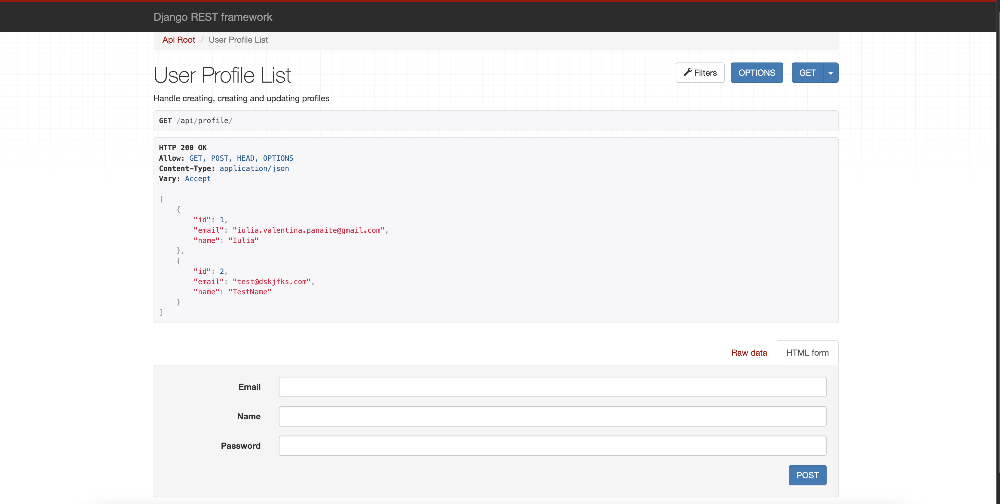
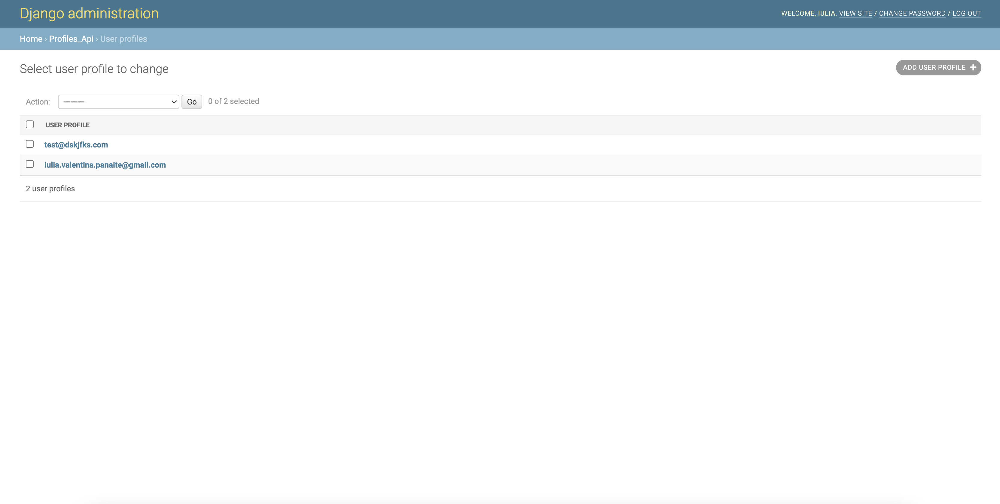
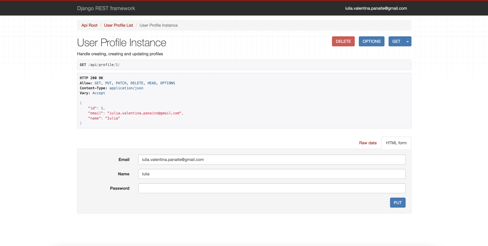

# Profiles REST API

A RESTful API built with **Django** and **Django REST Framework**, designed to manage user profiles and status updates.  
This project demonstrates common backend patterns such as authentication, CRUD operations, and feed management, following best practices for REST API design.

---

## Features

- **User Registration and Authentication** - Create and authenticate user accounts.
- **User Profile Management** - View, update, and delete user profiles.
- **Status Updates** - Create and manage user posts or status updates.
- **Public Feed** - View a feed of user status updates.
- **Browsable API** - Self-documenting API interface powered by Django REST Framework.

## Technologies Used

- **Python 3**
- **Django 2.2**
- **Django REST Framework 3.9**
- **SQLite** (default development database)
- **Vagrant** and **VirtualBox** (for isolated development environment)
- **AWS EC2** (for optional deployment)
- **ModHeaders** (for testing API headers)

---
